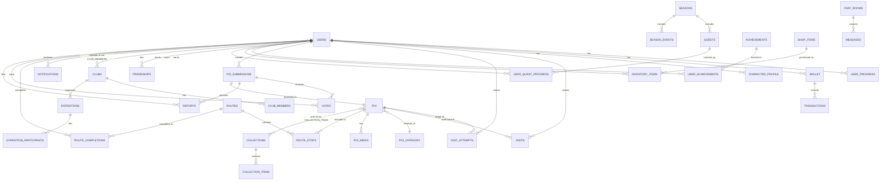

# ТЕХНИЧЕСКОЕ ЗАДАНИЕ (SOFTWARE REQUIREMENTS SPECIFICATION)

## Проект: «ТУРИСТ» — геолокационная PWA-игра по туризму Челябинской области

**Версия документа:** 1.0
**Дата:** 14 июля 2026 г.
**Статус:** Готово к передаче команде разработки
**Классификация:** Внутренний документ проекта

**Подготовлено виртуальной командой в составе:**
- Product Manager
- UX/UI Designer
- Game Designer
- Backend Architect
- Frontend Architect
- GIS Engineer
- Technical Lead

---

## СОДЕРЖАНИЕ

1. Введение
2. Обзор продукта и бизнес-модель
3. Целевая аудитория и пользовательские роли
4. Глоссарий терминов
5. Функциональные требования (полный перечень модулей)
6. Игровой дизайн и баланс экономики
7. UX/UI: карта экранов и пользовательские сценарии
8. Архитектура системы
9. Технологический стек
10. Модель данных и ER-диаграмма
11. Спецификация API
12. Геолокация, GPS-механики и античит
13. Безопасность
14. Производительность и масштабирование (регион → вся Россия)
15. PWA и офлайн-режим
16. Административная панель и модерация
17. Аналитика и метрики (KPI)
18. Тестирование и обеспечение качества
19. Дорожная карта разработки (Roadmap)
20. Риски и их митигация
21. Приложения

---

## 1. ВВЕДЕНИЕ

### 1.1. Назначение документа

Настоящий документ представляет собой полную функциональную и техническую спецификацию (Software Requirements Specification, SRS) веб-приложения «ТУРИСТ» — прогрессивного веб-приложения (PWA), реализующего механику дополненной геолокационной игры (в духе Pokémon GO), но полностью ориентированного на реальный туризм по Челябинской области с перспективой масштабирования на всю территорию Российской Федерации.

Документ предназначен для:
- команды разработки (frontend, backend, GIS, DevOps, QA);
- дизайнеров (UX/UI, game design);
- продуктового менеджмента и инвесторов;
- отдела модерации и поддержки;
- партнёров (туристические организации, ООПТ, музеи).

### 1.2. Область применения (Scope)

Продукт представляет собой:
- мобильное PWA-приложение, устанавливаемое на смартфон без магазинов приложений (Add to Home Screen);
- интерактивную 2D/2.5D карту региона с реальными географическими объектами;
- 3D-персонажа туриста с системой кастомизации;
- геймифицированную систему исследования реальных туристических точек с подтверждением через GPS, фотофиксацию и QR-коды;
- внутриигровую экономику без Pay-to-Win;
- социальные и соревновательные механики (клубы, рейтинги, командные экспедиции);
- пользовательский контент (добавление точек интереса) с системой модерации;
- административную панель для управления контентом, пользователями и античитом.

### 1.3. Вне области применения (Out of Scope, v1.0)

- Нативные мобильные приложения (iOS/Android в сторах) — не разрабатываются в рамках MVP, архитектура при этом не блокирует такую возможность в будущем через обёртку (Capacitor/Cordova) при необходимости.
- Оплата внутриигровой валюты за реальные деньги (принципиально исключено согласно ТЗ).
- VR/AR-режимы (потенциально в Roadmap v3.0+).

### 1.4. Определения, обозначения, сокращения

См. Раздел 4 «Глоссарий терминов».

### 1.5. Ссылочные документы

- OpenStreetMap Foundation — лицензия ODbL.
- Спецификация PWA (W3C Service Workers, Web App Manifest).
- Рекомендации 152-ФЗ «О персональных данных» (РФ).
- REST API Design Guidelines.

---

## 2. ОБЗОР ПРОДУКТА И БИЗНЕС-МОДЕЛЬ

### 2.1. Концепция одним предложением

«ТУРИСТ» превращает реальные путешествия по Челябинской области в игру: пользователь физически посещает природные, исторические и культурные объекты региона, «открывая» их на карте, прокачивая персонажа и собирая коллекции — подобно тому, как в Pokémon GO собираются покемоны, но вместо вымышленных существ игрок открывает для себя вполне реальный Урал.

### 2.2. Уникальное торговое предложение (УТП)

| УТП | Описание |
|---|---|
| Честная экономика | Игровая валюта не продаётся за реальные деньги — только косметика за донат, никакого влияния на прогресс. |
| Реальная ценность | Каждая точка — реальное место с историей, фото, фактами; игра стимулирует внутренний туризм региона. |
| Низкий порог входа | PWA без скачивания из сторов, регистрация по нику и паролю за 10 секунд. |
| Локальная специфика | Полное покрытие Челябинской области: Таганай, Зюраткуль, Аркаим, озеро Тургояк и сотни менее известных точек. |
| Пользовательский контент | Сообщество само дополняет карту, снижая затраты на создание контента. |
| Античит на уровне механик | Комбинация GPS + время нахождения + фото/QR исключает "накрутку" очков без реальных поездок. |

### 2.3. Бизнес-модель

**Источники дохода (не влияющие на баланс игры):**
1. Косметический донат: одежда, анимации, питомцы, рамки профиля, флажки экспедиций.
2. Партнёрские интеграции: туристические базы, музеи, национальные парки могут спонсировать ивенты и квесты (нативная реклама через "События недели").
3. B2G/B2B: продажа аналитики турпотока (обезличенной, агрегированной) министерству туризма Челябинской области и муниципалитетам.
4. Премиум-подписка (опционально, v2.0): расширенная статистика паспорта, приоритетная поддержка, эксклюзивные косметические предметы (без игровых преимуществ).

**Принципиально исключено:** покупка монет, опыта, ускорителей прогресса, преимуществ в открытии точек.

### 2.4. Ключевые метрики успеха продукта

- DAU/MAU (Daily/Monthly Active Users) в разрезе Челябинской области.
- Среднее число реально посещённых точек на пользователя в месяц.
- Retention D1/D7/D30.
- Конверсия в косметический донат (ARPPU не должен превышать 5-7% пользователей).
- Количество пользовательских точек, прошедших модерацию.
- NPS среди туристических организаций-партнёров.

### 2.5. Этапы запуска

1. **MVP (Pilot)** — Челябинская область, ~300-500 точек, базовые механики (карта, персонаж, посещение, опыт, монеты, магазин).
2. **v1.5** — социальные функции, клубы, маршруты, пользовательские точки.
3. **v2.0** — сезонные события, командные экспедиции, туристический паспорт, расширенная аналитика.
4. **v3.0** — масштабирование на Уральский федеральный округ, затем на всю Россию.

---

## 3. ЦЕЛЕВАЯ АУДИТОРИЯ И ПОЛЬЗОВАТЕЛЬСКИЕ РОЛИ

### 3.1. Портреты пользователей (Personas)

**Персона 1 — «Активный турист» (25-40 лет).** Ходит в походы по выходным, уже бывал на Таганае и Зюраткуле, ищет новые маршруты, ценит достижения и статистику.

**Персона 2 — «Городской геймер-новичок» (16-25 лет).** Играл в Pokémon GO, редко выбирается за город, мотивируется игровой прогрессией, ачивками и соревнованием с друзьями.

**Персона 3 — «Семья с детьми» (30-45 лет).** Ищет безопасные и интересные способы провести выходные с детьми, ценит образовательный контент (история мест) и коллекции.

**Персона 4 — «Локальный краевед/энтузиаст» (35-60 лет).** Хочет делиться знаниями о малоизвестных местах, добавляет пользовательские точки, важен статус и признание сообщества.

### 3.2. Роли пользователей в системе

| Роль | Описание | Ключевые права |
|---|---|---|
| Guest (неавторизованный) | Просмотр лендинга, публичной карты (ограниченно) | Только просмотр |
| Player (игрок) | Базовая роль после регистрации | Исследование точек, магазин, соцфункции, добавление точек |
| Verified Player | Игрок с подтверждённым email/телефоном (опционально) | + повышенные лимиты добавления точек |
| Trusted Contributor | Игрок с высоким рейтингом добавленных точек (>50 одобренных) | + автопубликация точек без модерации, + голос "весит больше" |
| Club Leader | Создатель/администратор клуба туристов | + управление составом клуба, командные экспедиции |
| Moderator | Модератор контента (найм/волонтёр) | Проверка точек, фото, жалоб, блокировка контента |
| Content Manager | Сотрудник, отвечающий за официальный контент (истории мест, ивенты) | Публикация ивентов, редактирование карточек мест |
| Support Agent | Поддержка пользователей | Просмотр тикетов, возврат/компенсации в игровой валюте |
| Analyst | Аналитик (в т.ч. B2G-партнёры) | Доступ к обезличенной агрегированной аналитике |
| Administrator | Полный доступ | Управление всеми ролями, конфигурацией, античит-политиками |


---

## 4. ГЛОССАРИЙ ТЕРМИНОВ

| Термин | Значение |
|---|---|
| Точка интереса (ТИ / POI) | Реальный географический объект на карте: гора, озеро, музей, памятник и т.д. |
| Геозона (Geofence) | Виртуальная зона радиусом ~30 м вокруг ТИ, при входе в которую активируется кнопка «Исследовать». |
| Опыт (XP) | Очки прогресса персонажа, определяющие уровень. |
| Монеты (Coins) | Внутриигровая валюта, зарабатывается только через исследование и задания, тратится на косметику. |
| Секретная точка | ТИ, скрытая от игроков без способности «Опытный турист» (открывается за 10 000 очков). |
| Туристический паспорт | Персональная страница статистики и достижений игрока. |
| Клуб | Постоянное сообщество игроков (аналог гильдии). |
| Экспедиция | Временное совместное мероприятие клуба/группы друзей с общей целью. |
| Маршрут | Заранее составленная последовательность ТИ с наградой за полное прохождение. |
| Модерация | Процесс проверки пользовательского контента (текст, фото, координаты). |
| Античит | Совокупность механик защиты от накрутки прогресса без реального посещения. |
| PWA | Progressive Web App — веб-приложение, устанавливаемое на устройство как нативное. |
| Service Worker | Фоновый скрипт браузера, обеспечивающий офлайн-кэширование и push-уведомления. |
| PostGIS | Геопространственное расширение PostgreSQL. |
| GeoJSON | Формат представления географических объектов в JSON. |

---

## 5. ФУНКЦИОНАЛЬНЫЕ ТРЕБОВАНИЯ

Требования сгруппированы по модулям. Каждое требование имеет уникальный идентификатор формата **FR-<Модуль>-<Номер>** для трассируемости в бэклоге.

### 5.1. Модуль AUTH — Регистрация и аутентификация

| ID | Требование | Приоритет |
|---|---|---|
| FR-AUTH-01 | Регистрация только по нику (3-20 символов, уникальный) и паролю (мин. 8 символов). Без email/телефона на старте. | Must |
| FR-AUTH-02 | Пароли хранятся в виде хэша Argon2id с солью. | Must |
| FR-AUTH-03 | Аутентификация по JWT (access-токен 15 мин, refresh-токен 30 дней, хранится в httpOnly cookie или secure storage). | Must |
| FR-AUTH-04 | Опциональная привязка email или Telegram/Google OAuth для восстановления доступа. | Should |
| FR-AUTH-05 | Восстановление доступа через "секретную фразу", если email/телефон не привязаны (компромисс анонимности и восстанавливаемости). | Should |
| FR-AUTH-06 | Ограничение попыток входа: 5 попыток / 15 минут на IP+ник (защита от брутфорса). | Must |
| FR-AUTH-07 | Возможность полного удаления аккаунта и данных по запросу пользователя (право на удаление, 152-ФЗ). | Must |
| FR-AUTH-08 | Двухфакторная аутентификация (TOTP) — опционально для Trusted Contributor/Moderator+. | Could |

### 5.2. Модуль CHARACTER — Персонаж

| ID | Требование | Приоритет |
|---|---|---|
| FR-CHAR-01 | При регистрации выбор пола/архетипа персонажа (парень/девушка), базовая внешность. | Must |
| FR-CHAR-02 | Базовая экипировка: футболка, шорты, кроссовки, рюкзак — из низкополигональных 3D-моделей (glTF/GLB). | Must |
| FR-CHAR-03 | Персонаж отображается на экране карты как 3D-аватар (Three.js/Babylon.js рендер поверх карты либо в отдельном viewport). | Must |
| FR-CHAR-04 | Система смены экипировки: одежда, обувь, головные уборы, рюкзаки, транспорт (велосипед/лыжи/байдарка как визуальные скины). | Must |
| FR-CHAR-05 | Анимации: идле, ходьба, открытие точки, эмоции (набор эмодзи-жестов). | Should |
| FR-CHAR-06 | Питомцы-компаньоны (косметические, не дающие игровых бонусов) — покупаются за монеты/донат. | Could |
| FR-CHAR-07 | Экран предпросмотра персонажа (поворот 360°, зум) при выборе экипировки в магазине. | Should |

### 5.3. Модуль MAP — Интерактивная карта

| ID | Требование | Приоритет |
|---|---|---|
| FR-MAP-01 | Отображение карты Челябинской области на базе OpenStreetMap через MapLibre GL JS (векторные тайлы). | Must |
| FR-MAP-02 | Слои: дороги, леса, гидрография, рельеф (хиллшейд), административные границы. | Must |
| FR-MAP-03 | Отображение ТИ цветными маркерами-иконками по категориям (см. 5.4). | Must |
| FR-MAP-04 | Кластеризация маркеров при отдалении карты (снижение нагрузки на рендер и читаемость). | Must |
| FR-MAP-05 | Геолокация пользователя в реальном времени (синяя точка + направление взгляда через Device Orientation API). | Must |
| FR-MAP-06 | Отображение радиуса геозоны (30 м) вокруг ближайших ТИ. | Must |
| FR-MAP-07 | Погодный слой (текущая погода в районе видимой области карты, интеграция с внешним API). | Should |
| FR-MAP-08 | Отображение активных пользовательских маршрутов и совместных экспедиций друзей на карте. | Should |
| FR-MAP-09 | Фильтры карты по категориям точек (озёра, горы, музеи и т.д.) и по статусу (открыто/не открыто). | Must |
| FR-MAP-10 | Оффлайн-режим карты: предзагрузка тайлов видимой области при наличии интернета для последующего использования без связи (см. Раздел 15). | Must |
| FR-MAP-11 | Плавная анимация приближения/удаления, инерционный скролл, поддержка жестов pinch-to-zoom. | Must |

### 5.4. Модуль POI — Точки интереса

**Категории и цветовая кодировка (согласно исходной концепции):**

| Категория | Цвет маркера | Примеры |
|---|---|---|
| Открытые (обычные) | 🟢 Зелёный | Стандартные, доступные всем точки |
| Редкие | 🟣 Фиолетовый | Труднодоступные, уникальные объекты |
| Исторические | 🟡 Жёлтый | Памятники, усадьбы, места сражений |
| Озёра | 🔵 Синий | Тургояк, Зюраткуль, Увильды |
| Горы | 🟤 Коричневый | Таганай, Нургуш, Юрма |
| Секретные | ⚫ Чёрный (скрыт до открытия способности) | Малоизвестные пещеры, заброшенные шахты |

| ID | Требование | Приоритет |
|---|---|---|
| FR-POI-01 | Карточка ТИ включает: название, категория, координаты, история (текст), фотогалерея, интересные факты, лучшее время посещения, сложность/доступность, статус (открыта/закрыта пользователем). | Must |
| FR-POI-02 | Иерархия видимости: обычные точки видны всем; секретные — только после покупки способности «Опытный турист» (порог 10 000 XP). | Must |
| FR-POI-03 | Официальный контент (истории, факты) вносится Content Manager, редактируется через админ-панель. | Must |
| FR-POI-04 | Возможность подписки на ТИ ("хочу посетить") — попадает в личный wish-list паспорта. | Should |
| FR-POI-05 | Отображение количества игроков, посетивших точку ("Открыли: 4 213 игроков"), и последних открывших. | Should |
| FR-POI-06 | Для каждой точки — рекомендованные ближайшие точки (для построения маршрута на месте). | Could |

### 5.5. Модуль EXPLORE — Механика посещения и подтверждения

| ID | Требование | Приоритет |
|---|---|---|
| FR-EXP-01 | Кнопка «Исследовать» активна только когда: расстояние до ТИ < 30 м (по данным GPS) И пользователь находится в зоне не менее 2 минут непрерывно. | Must |
| FR-EXP-02 | При активации — для обычных точек: анимация открытия + начисление XP и монет согласно редкости точки. | Must |
| FR-EXP-03 | Для точек повышенной ценности (редкие/секретные/популярные) — дополнительное подтверждение: селфи-фото ИЛИ фото места ИЛИ сканирование QR-кода на информационном стенде объекта. | Must |
| FR-EXP-04 | Разовое открытие: повторное посещение той же точки не даёт повторного XP/монет, но засчитывается в статистику "визитов" и может открыть бонус за визит в другой сезон (см. Сезоны). | Must |
| FR-EXP-05 | Анимация награды: частицы, левитирующие монеты, подсветка иконки уровня, короткий звук/вибро-отклик. | Should |
| FR-EXP-06 | Офлайн-открытие: если точка была подтверждена в офлайне (GPS-лог + фото), синхронизация и начисление награды при восстановлении связи. | Must |
| FR-EXP-07 | Индикатор прогресса геозоны (радиальный таймер 2 минуты) с визуальной обратной связью на экране. | Should |

### 5.6. Модуль PROGRESSION — Опыт, уровни, звания

Система званий (по исходной концепции), 6 ступеней:

`Новичок → Путешественник → Исследователь → Следопыт → Эксперт → Легенда Урала`

| ID | Требование | Приоритет |
|---|---|---|
| FR-PROG-01 | XP начисляется за: открытие ТИ (базово), выполнение квестов, прохождение маршрутов, участие в событиях, публикацию одобренных пользовательских точек. | Must |
| FR-PROG-02 | Кривая уровней нелинейная (см. Раздел 6.2), пороги XP настраиваются через конфиг без деплоя (feature flag / remote config). | Must |
| FR-PROG-03 | При смене звания — полноэкранная анимация + уведомление + запись в паспорт. | Should |
| FR-PROG-04 | Прогресс-бар текущего уровня отображается в HUD карты и в профиле. | Must |

### 5.7. Модуль ECONOMY — Монеты и магазин

| ID | Требование | Приоритет |
|---|---|---|
| FR-ECO-01 | Монеты начисляются исключительно за игровые действия (см. FR-PROG-01), не покупаются за реальные деньги. | Must |
| FR-ECO-02 | Магазин: категории — одежда, обувь, головные уборы, рюкзаки, транспортные скины, питомцы, анимации/эмоции, флажки экспедиций, рамки профиля. | Must |
| FR-ECO-03 | Донат (реальные деньги) доступен ТОЛЬКО для косметических предметов, обозначенных отдельной валютой "Кристаллы" — не конвертируется в монеты и не даёт игровых преимуществ. | Must |
| FR-ECO-04 | Способность «Опытный турист» (открытие секретных точек) покупается ТОЛЬКО за монеты (10 000 XP-эквивалент), не за донат — чтобы сохранить принцип "не Pay-to-Win". | Must |
| FR-ECO-05 | История транзакций в профиле (начисления/списания монет и кристаллов). | Should |
| FR-ECO-06 | Ежедневный бонус за вход (небольшое количество монет, нарастающий стрик). | Should |
| FR-ECO-07 | Лимиты анти-инфляции: балансировка стоимости предметов относительно среднего заработка (см. Раздел 6.3). | Must |

### 5.8. Модуль ACHIEVEMENTS — Достижения

| ID | Требование | Приоритет |
|---|---|---|
| FR-ACH-01 | Каталог достижений с категориями: по количеству (посетил N озёр/гор), по конкретным местам (Аркаим, Таганай, Зюраткуль), по условиям (зимний поход, 100 км пройдено), по редкости находок (первое секретное место). | Must |
| FR-ACH-02 | Прогресс-бар для многоступенчатых достижений (напр. "Посетил 10/20/50/100 озёр" — бронза/серебро/золото). | Should |
| FR-ACH-03 | Уведомление и анимация при получении достижения, публикация в ленту клуба/друзей (опционально, с настройкой приватности). | Should |
| FR-ACH-04 | Витрина достижений в туристическом паспорте с фильтрами (открытые/скрытые/по категориям). | Must |

### 5.9. Модуль COLLECTIONS — Коллекции

| ID | Требование | Приоритет |
|---|---|---|
| FR-COL-01 | Тематические коллекции: «Все водопады», «Все нацпарки», «Все пещеры», «Все горы выше 1000 м», «Все музеи», «Все озёра». | Must |
| FR-COL-02 | Визуальный трекер коллекции (сетка карточек, серые — не собрано, цветные — собрано). | Must |
| FR-COL-03 | Уникальная награда (эксклюзивный косметический предмет + звание/бейдж) за завершение коллекции на 100%. | Must |

### 5.10. Модуль QUESTS — Ежедневные и тематические задания

| ID | Требование | Приоритет |
|---|---|---|
| FR-QST-01 | Ежедневные задания (2-3 шт/день): "открой 1 точку", "пройди 3 км", "сделай фото места". | Must |
| FR-QST-02 | Еженедельные/тематические квесты: "Открой 5 озёр" → 5000 монет; "Посети 3 нацпарка" → редкая одежда. | Must |
| FR-QST-03 | Прогресс квестов отслеживается автоматически по игровым событиям (открытие точки, пройденное расстояние, категория). | Must |
| FR-QST-04 | Экран "Задания" с таймером до сброса, наградами и прогресс-барами. | Must |

### 5.11. Модуль SEASONS — Сезонные события

| ID | Требование | Приоритет |
|---|---|---|
| FR-SEA-01 | Четыре сезонных события в год, привязанные к календарю: «Зимний поход», «Летний марафон», «Осенние краски», «Весеннее пробуждение». | Must |
| FR-SEA-02 | Сезонные задания, эксклюзивные косметические награды, ограниченные по времени баннеры на карте. | Must |
| FR-SEA-03 | Событийные множители наград (напр. x2 монеты на выходных для точки/региона недели). | Should |
| FR-SEA-04 | Административный конструктор событий (даты, задания, награды) без релиза кода. | Must |

### 5.12. Модуль ROUTES — Маршруты

| ID | Требование | Приоритет |
|---|---|---|
| FR-RTE-01 | Официальные тематические маршруты, создаваемые Content Manager: «5 лучших озёр», «Поездка выходного дня» и т.п. | Must |
| FR-RTE-02 | Пользовательские маршруты: игрок компонует последовательность из открытых им или существующих ТИ и публикует для сообщества. | Should |
| FR-RTE-03 | Прохождение маршрута целиком (все точки открыты в рамках маршрута) даёт бонусную награду. | Must |
| FR-RTE-04 | Построение маршрута на карте с расчётом расстояния, набора высоты, ориентировочного времени в пути. | Should |
| FR-RTE-05 | Рейтинг и отзывы на маршруты (звёзды + комментарий). | Could |

### 5.13. Модуль SOCIAL — Социальные функции

| ID | Требование | Приоритет |
|---|---|---|
| FR-SOC-01 | Список друзей: добавление по нику, запросы дружбы. | Must |
| FR-SOC-02 | Клубы туристов: создание (Club Leader), вступление по заявке/инвайту, до N участников (настраивается), общий чат. | Must |
| FR-SOC-03 | Совместные походы: приглашение друзей на конкретную ТИ/маршрут с общим таймингом. | Should |
| FR-SOC-04 | Командные экспедиции: клуб как единое целое выполняет цель (напр. суммарно открыть 500 точек за месяц) с общей наградой, распределяемой пропорционально вкладу. | Should |
| FR-SOC-05 | Внутриигровой текстовый чат (клубный и личный), с базовой модерацией по стоп-словам + жалобами. | Must |
| FR-SOC-06 | Лента активности друзей/клуба (кто что открыл, какое достижение получил). | Should |

### 5.14. Модуль RATING — Рейтинги

| ID | Требование | Приоритет |
|---|---|---|
| FR-RAT-01 | Лидерборды: топ игроков за неделю/месяц/год/всё время по XP. | Must |
| FR-RAT-02 | Лидерборды по клубам (совокупный прогресс). | Should |
| FR-RAT-03 | Локальные рейтинги (топ по муниципальному району) — стимулирует локальную конкуренцию. | Could |
| FR-RAT-04 | Рейтинг лучших авторов пользовательских точек (по количеству одобренных/лайкам). | Should |

### 5.15. Модуль PASSPORT — Туристический паспорт

| ID | Требование | Приоритет |
|---|---|---|
| FR-PAS-01 | Паспорт содержит: уровень/звание, суммарные километры, список открытых мест, достижения, коллекции, избранные места, полную статистику (сезонность посещений, любимая категория и т.д.). | Must |
| FR-PAS-02 | Визуальное оформление в стиле «путевого паспорта» со штампами за каждую значимую точку/коллекцию. | Should |
| FR-PAS-03 | Возможность поделиться паспортом (публичная read-only ссылка / экспорт изображения для соцсетей). | Should |
| FR-PAS-04 | Экспорт статистики в PDF (опционально, v2.0). | Could |

### 5.16. Модуль UGC — Пользовательские точки интереса

| ID | Требование | Приоритет |
|---|---|---|
| FR-UGC-01 | Форма добавления точки: название, описание, до 5 фото, координаты (GPS-автоопределение или ручной пин на карте), категория, теги доступности. | Must |
| FR-UGC-02 | Новая точка получает статус `pending` и не отображается на общей карте до модерации/голосования. | Must |
| FR-UGC-03 | Голосование сообщества: 👍/👎, доступно только игрокам, физически находившимся в радиусе 5 км от точки ИЛИ достигшим определённого уровня (защита от накрутки голосов). | Must |
| FR-UGC-04 | Правила перехода статуса: ≥50 лайков (net) → статус `official` (попадает на основную карту всем); ≥10 лайков → статус `hidden_map` (видна только на «скрытой карте» энтузиастов); большое количество жалоб (порог настраивается, напр. ≥5 жалоб при net-рейтинге <0) → статус `removed`. | Must |
| FR-UGC-05 | Модератор может вручную одобрить/отклонить/отредактировать точку вне очереди голосования (напр. при явном нарушении или явной ценности). | Must |
| FR-UGC-06 | Автор точки получает бонусный XP/монеты при переходе в `official`, дополнительный бонус — при высоком рейтинге лайков. | Must |
| FR-UGC-07 | Trusted Contributor (роль) — автопубликация без ожидания голосования (сразу `official` либо `hidden_map` в зависимости от типа). | Should |
| FR-UGC-08 | Жалоба на точку с указанием причины (дубликат, неточные координаты, оскорбительный контент, опасность/частная территория). | Must |

### 5.17. Модуль NOTIFICATIONS — Уведомления

| ID | Требование | Приоритет |
|---|---|---|
| FR-NOT-01 | Push-уведомления через Web Push API (Service Worker): новые квесты, сезонные события, приглашения в клуб/поход, достижения друзей, приближение к неоткрытой точке (геотриггер). | Must |
| FR-NOT-02 | In-app центр уведомлений с историей и статусом прочтения. | Must |
| FR-NOT-03 | Настройки уведомлений по категориям (пользователь может отключить любую группу). | Must |
| FR-NOT-04 | Геотриггер-уведомление: "Рядом с вами есть неоткрытая точка «Озеро Тургояк» — 350 м" (при включённой геолокации в фоне, с явного согласия пользователя). | Should |

### 5.18. Модуль ADMIN — Административная панель

Подробно в Разделе 16.

### 5.19. Сводная таблица приоритетов MVP

| Модуль | В MVP | Post-MVP |
|---|---|---|
| Auth, Character, Map, POI, Explore, Progression, Economy (базовая) | ✅ | |
| Achievements, Collections, Quests (ежедневные) | ✅ | |
| UGC (добавление точек) базовая версия | ✅ | |
| Notifications (базовые push) | ✅ | |
| Social (друзья, клубы), Routes, Seasons, Rating (полный) | | ✅ v1.5-2.0 |
| Командные экспедиции, паспорт с шарингом, аналитика для партнёров | | ✅ v2.0 |
| Масштабирование на всю Россию | | ✅ v3.0 |

---

## 6. ИГРОВОЙ ДИЗАЙН И БАЛАНС ЭКОНОМИКИ

### 6.1. Игровые циклы (Game Loops)

**Микро-цикл (сессия 5-30 минут):** Открыть карту → увидеть ближайшую неоткрытую точку → дойти → выполнить условие геозоны → открыть → получить награду → проверить прогресс дневного задания.

**Мезо-цикл (неделя):** Выполнение еженедельных квестов → прогресс в коллекции → участие в клубной активности → проверка позиции в недельном лидерборде.

**Макро-цикл (сезон, 3 месяца):** Участие в сезонном событии → накопление XP до следующего звания → завершение крупной коллекции → получение эксклюзивной сезонной награды.

### 6.2. Кривая прогрессии уровней

Нелинейная кривая (условный пример, окончательные значения — предмет баланс-тестирования):

| Звание | Диапазон XP | Прим. кол-во точек для достижения* |
|---|---|---|
| Новичок | 0 – 1 000 | 1-2 |
| Путешественник | 1 000 – 5 000 | 5-8 |
| Исследователь | 5 000 – 15 000 | 15-20 |
| Следопыт | 15 000 – 40 000 | 40-50 |
| Эксперт | 40 000 – 100 000 | 100-120 |
| Легенда Урала | 100 000+ | 250+ |

\* при базовой награде ~500-1000 XP за обычную точку, с учётом бонусов за квесты и коллекции.

Способность «Опытный турист» открывается при достижении 10 000 XP (совпадает с серединой ранга «Исследователь»), что мотивирует прогресс без чрезмерного разрыва между новичками и опытными игроками.

### 6.3. Балансировка наград (референсные значения)

| Действие | XP | Монеты |
|---|---|---|
| Открытие обычной (🟢) точки | 200 | 1000 |
| Открытие исторической (🟡) точки | 300 | 1200 |
| Открытие точки-озера/горы (🔵🟤) | 300 | 1200 |
| Открытие редкой (🟣) точки | 600 | 2500 |
| Открытие секретной (⚫) точки | 1000 | 4000 |
| Ежедневное задание | 100-300 | 300-800 |
| Еженедельный квест | 500-1500 | 2000-5000 |
| Полное прохождение маршрута | +30% от суммы точек маршрута | +30% |
| Завершение коллекции | 2000-5000 | 5000-10000 + эксклюзивный предмет |
| Ежедневный вход (стрик, макс. на 7-й день) | — | 100-1000 (нарастающе) |

**Стоимость предметов в магазине** калибруется так, чтобы базовый предмет одежды стоил ≈ 1-2 открытых обычных точки (2000-4000 монет), а редкий/сезонный предмет — ≈ 1 неделя активной игры (15 000-25 000 монет). Это удерживает ощущение прогресса без необходимости доната.

**Способность «Опытный турист»:** фиксированная цена, эквивалентная примерно 2-3 неделям активной игры для игрока среднего темпа (баланс уточняется на этапе плейтестов).

### 6.4. Анти-инфляционные меры

- Периодическая ревизия экономики (ежеквартально): анализ среднего накопления/траты монет по когортам.
- Ограничение повторного фарма: точка даёт награду один раз за аккаунт (см. FR-EXP-04).
- Сезонное "устаревание" части косметики (ротация магазина) для поддержания ценности новых предметов без влияния на прогресс.
- Мягкие кап-лимиты на XP/монеты в день от заданий (не от исследования — реальные поездки не ограничиваются).

### 6.5. Психология вовлечения (этичный геймдизайн)

Продукт сознательно избегает тёмных паттернов (dark patterns), характерных для части free-to-play игр:
- Нет таймеров с искусственным давлением на покупку.
- Нет "энергии"/лимитов на количество действий в день, ограничивающих исследование (реальный мир — единственное ограничение).
- Нет лутбоксов за реальные деньги (косметика приобретается напрямую, видом предмета до покупки).
- Уведомления геотриггеров настраиваются и не являются навязчивыми (частота ограничена).

---

## 7. UX/UI: КАРТА ЭКРАНОВ И ПОЛЬЗОВАТЕЛЬСКИЕ СЦЕНАРИИ

### 7.1. Принципы дизайна

- **Mobile-first, one-hand usability**: основные действия достижимы большим пальцем в нижней трети экрана.
- **Карта как домашний экран**: приложение открывается сразу на карте (аналогично Pokémon GO), а не на дашборде.
- **Минимализм в полевых условиях**: крупные тач-зоны (мин. 44×44 px), высокая контрастность для использования на солнце.
- **Энергоэффективность**: снижение частоты обновления GPS/рендера 3D при низком заряде батареи (адаптивный режим).
- **Единый визуальный язык**: природная палитра (зелень, охра, синева Урала) + акцентный цвет бренда.

### 7.2. Полный перечень экранов

1. **Splash / Онбординг** — приветствие, объяснение механик (3-4 слайда), запрос разрешений (геолокация, уведомления, камера).
2. **Экран регистрации/входа** — ник, пароль, переключатель вход/регистрация.
3. **Выбор персонажа** — пол/архетип, базовая внешность, подтверждение.
4. **Главный экран — Карта (Home)** — основной экран приложения.
5. **Карточка точки интереса (POI Detail)** — модальное окно/шторка снизу.
6. **Экран подтверждения посещения (Explore Flow)** — таймер геозоны → камера/QR → анимация награды.
7. **Профиль / Туристический паспорт**.
8. **Достижения (Achievements)**.
9. **Коллекции (Collections)**.
10. **Задания (Quests)** — ежедневные/еженедельные/сезонные табы.
11. **Магазин (Shop)** — категории, предпросмотр персонажа.
12. **Инвентарь (Inventory)**.
13. **Маршруты (Routes)** — список, детали, построитель.
14. **Друзья / Клубы (Social)**.
15. **Чат (клубный/личный)**.
16. **Рейтинги (Leaderboards)**.
17. **Добавление точки (Add POI)** — форма + модерационная очередь автора.
18. **Уведомления (Notification Center)**.
19. **Настройки (Settings)** — приватность, уведомления, офлайн-карты, аккаунт.
20. **Экран событий (Season/Event Hub)**.
21. **Онбординг офлайн-карт (Download Region)**.
22. **Экран ошибок/пустых состояний** (нет сети, GPS выключен, нет точек рядом).

### 7.3. Детализация ключевых экранов

#### 7.3.1. Главный экран — Карта

**Зоны интерфейса:**
- **Верхняя панель (HUD):** аватар-иконка (→ профиль), уровень/звание с прогресс-баром, счётчик монет, счётчик кристаллов (донат-валюта), иконка уведомлений (с бейджем счётчика).
- **Карта (основная область):** 3D-персонаж в текущей геопозиции, маркеры ТИ, радиус геозоны для ближайшей точки, кластеры.
- **Нижняя панель навигации (Tab Bar, 5 иконок):** Карта (домашняя) · Задания · Магазин · Паспорт · Соцфункции.
- **Плавающая кнопка (FAB):** «+ Добавить точку» (появляется контекстно рядом с текущей позицией).
- **Мини-виджет "Ближайшая точка"**: карточка внизу с расстоянием и направлением, свайп для перехода к следующей ближайшей.

**Пользовательский сценарий "Первое открытие точки":**
1. Пользователь открывает приложение → видит карту с синей меткой своего местоположения.
2. Замечает зелёный маркер в 200 м → нажимает на него → открывается нижняя шторка с превью карточки ТИ.
3. Нажимает «Проложить путь» (опционально) или просто идёт в направлении точки.
4. При входе в радиус 30 м на карте активируется круговой таймер (2 мин), кнопка «Исследовать» становится активной по истечении.
5. Нажимает «Исследовать» → для обычной точки сразу воспроизводится анимация награды (частицы, +XP, +монеты).
6. Открывается полная карточка места с историей, фото, фактами — пользователь может пролистать.
7. Всплывающее уведомление о прогрессе дневного задания ("Открой 1 точку — выполнено!").

#### 7.3.2. Карточка точки интереса

Структура (снизу вверх, bottom sheet с drag-handle):
- Фотогалерея (свайп, полноэкранный просмотр по тапу).
- Название, категория-бейдж, статус (открыто/не открыто), координаты, кнопка "Проложить маршрут".
- Блок "История места" (сворачиваемый текст).
- Блок "Интересные факты" (карточки-чипы).
- Блок "Лучшее время посещения" (иконки сезонов).
- Блок статистики: "Открыли: N игроков", аватары последних посетивших.
- Отзывы/фото других игроков (лента, модерируемая).
- Кнопка "В избранное" (сердце) и "Пожаловаться".

#### 7.3.3. Экран подтверждения посещения (для редких/секретных точек)

1. Активная кнопка «Исследовать» → модальное окно выбора способа подтверждения: 📷 Сделать фото / 🤳 Селфи / 📲 Сканировать QR.
2. Открывается системная камера (через `<input capture>` или MediaDevices API) или QR-сканер (на базе библиотеки распознавания в браузере).
3. После успешной фиксации — экран загрузки (передача на сервер) → анимация награды.
4. При отсутствии сети — сохранение локально (IndexedDB) с пометкой "к синхронизации", отложенная отправка.

#### 7.3.4. Магазин и кастомизация персонажа

- Левая часть/верх — 3D-предпросмотр персонажа с возможностью вращения (touch drag).
- Табы категорий: Одежда · Обувь · Головные уборы · Рюкзаки · Транспорт · Питомцы · Эмоции · Рамки.
- Карточка предмета: превью, цена (монеты или кристаллы — визуально разными иконками), кнопка "Примерить" и "Купить".
- Индикатор "Новинка" / "Сезонный" / "Эксклюзив за коллекцию".

#### 7.3.5. Туристический паспорт

- Шапка: аватар, ник, звание, дата регистрации ("Турист с ноября 2026").
- Статистика-плитки: суммарные км, открытых мест, дней в игре, достижений.
- Раздел "Штампы" — визуальные штампы за крупные точки/коллекции (стилизация под бумажный паспорт).
- Кнопка "Поделиться паспортом" (генерация карточки-изображения для соцсетей через Canvas API).

#### 7.3.6. Добавление точки (UGC)

Пошаговая форма (wizard, 4 шага):
1. Координаты — автоопределение по GPS ("Вы здесь?") либо ручная установка пина на мини-карте.
2. Фото — до 5 штук, минимум 1 обязательно.
3. Описание — название (обязательно), категория (select), описание (textarea, мин. 50 символов), теги доступности (доступность для детей/зимой/на авто).
4. Проверка и отправка — предпросмотр карточки как её увидят другие → «Отправить на модерацию».

После отправки — экран статуса "Ваша точка на рассмотрении" в разделе "Мои точки" профиля с индикатором голосов 👍/👎 в реальном времени.

### 7.4. Пустые состояния и ошибки (Empty/Error States)

| Ситуация | UX-реакция |
|---|---|
| GPS выключен | Полноэкранный оверлей с объяснением + кнопка "Включить геолокацию" (deep link в настройки браузера/ОС). |
| Нет точек рядом (>10 км) | Дружелюбное сообщение + предложение посмотреть карту целиком / изучить маршруты. |
| Нет интернета | Баннер "Офлайн-режим: доступна кэшированная карта" + очередь несинхронизированных действий. |
| Точка уже открыта другим способом (гонка условий) | Мягкое сообщение "Точка уже открыта" без повторной награды, без ошибки. |
| Долгая загрузка 3D-ассетов на слабом устройстве | Прогресс-бар + автоматический fallback на 2D-аватар (упрощённая версия). |

### 7.5. Адаптивность и доступность (Accessibility)

- Поддержка тёмной темы (снижение нагрузки на батарею OLED-экранов, комфорт в сумерках похода).
- Крупный шрифт / режим для слабовидящих (настройка масштаба текста).
- Голосовые подсказки направления (опционально, v2.0) для использования "не глядя в экран" во время ходьбы.
- Поддержка экранных читалок (aria-labels на ключевых интерактивных элементах несмотря на кастомный canvas-рендер карты — дублирование списком в accessible DOM).

---

## 8. АРХИТЕКТУРА СИСТЕМЫ

### 8.1. Общий подход

На старте (MVP, региональный масштаб) используется **модульный монолит** на NestJS с чёткими границами модулей (Domain-Driven Design, каждый модуль — свой набор контроллеров/сервисов/репозиториев). Это ускоряет разработку и упрощает деплой, но модули проектируются так, чтобы при масштабировании на всю Россию их можно было безболезненно вынести в отдельные микросервисы (Strangler Fig подход).

### 8.2. Логическая схема компонентов

```
┌─────────────────────────────────────────────────────────────────┐
│                         КЛИЕНТ (PWA)                              │
│  React + Next.js · Service Worker · IndexedDB (офлайн-очередь)    │
│  MapLibre GL JS (карта) · Three.js/Babylon.js (3D-персонаж)       │
└───────────────────────────────┬───────────────────────────────────┘
                                 │ HTTPS/REST + WebSocket (чат, realtime)
                                 ▼
┌─────────────────────────────────────────────────────────────────┐
│                    API GATEWAY / EDGE (Nginx/Cloudflare)          │
│         TLS termination · Rate limiting · WAF · CDN для тайлов    │
└───────────────────────────────┬───────────────────────────────────┘
                                 ▼
┌─────────────────────────────────────────────────────────────────┐
│                     BACKEND (NestJS, модульный монолит)           │
│  ┌───────────┐ ┌───────────┐ ┌───────────┐ ┌───────────────┐     │
│  │  Auth      │ │  POI/GIS  │ │  Explore/  │ │  Economy/Shop │     │
│  │  Module    │ │  Module   │ │  Anticheat │ │  Module       │     │
│  └───────────┘ └───────────┘ └───────────┘ └───────────────┘     │
│  ┌───────────┐ ┌───────────┐ ┌───────────┐ ┌───────────────┐     │
│  │ Social/    │ │ Quests/   │ │ UGC/       │ │ Notification  │     │
│  │ Clubs      │ │ Seasons   │ │ Moderation │ │ Module        │     │
│  └───────────┘ └───────────┘ └───────────┘ └───────────────┘     │
│  ┌───────────────────────────────────────────────────────────┐   │
│  │        Admin API · Analytics API (BFF для партнёров)        │   │
│  └───────────────────────────────────────────────────────────┘   │
└──────┬─────────────┬─────────────┬─────────────┬─────────────────┘
       ▼              ▼             ▼             ▼
 ┌───────────┐  ┌───────────┐ ┌───────────┐ ┌────────────────┐
 │ PostgreSQL │  │   Redis   │ │ S3-совм.  │ │ Message Queue   │
 │ + PostGIS  │  │  (cache,  │ │ хранилище │ │ (BullMQ/Redis   │
 │ (основная  │  │  сессии,  │ │ (фото,    │ │  Streams) —     │
 │  БД)       │  │  геокеш)  │ │  3D-ассеты)│ │  модерация,     │
 └───────────┘  └───────────┘ └───────────┘ │  push, аналитика│
                                              └────────────────┘
       ▼
┌─────────────────────────────────────────────────────────────────┐
│  ВНЕШНИЕ СЕРВИСЫ: OSM Tile/Vector сервер · Weather API ·           │
│  Web Push (VAPID) · OAuth провайдеры (Google/Telegram) ·           │
│  Антифрод/Geo-IP · Модерация изображений (опц. ML-сервис)          │
└─────────────────────────────────────────────────────────────────┘
```

### 8.3. Границы модулей (bounded contexts)

| Модуль | Ответственность | Ключевые сущности |
|---|---|---|
| Auth | Регистрация, вход, токены, роли | User, Session, RefreshToken |
| Character | Кастомизация персонажа | CharacterProfile, Equipment |
| POI/GIS | Каталог точек, гео-запросы | POI, POICategory, POIMedia |
| Explore/Anticheat | Логика посещения, верификация | VisitAttempt, Visit, GeoLog |
| Progression | XP, уровни, звания | UserProgress, Rank |
| Economy/Shop | Валюта, магазин, инвентарь | Wallet, Transaction, ShopItem, InventoryItem |
| Achievements | Ачивки, коллекции | Achievement, Collection, UserAchievement |
| Quests/Seasons | Задания, события | Quest, UserQuestProgress, Season, SeasonEvent |
| Routes | Маршруты | Route, RouteStop, RouteCompletion |
| Social/Clubs | Друзья, клубы, экспедиции | Friendship, Club, ClubMember, Expedition |
| Chat | Realtime-сообщения | ChatRoom, Message |
| UGC/Moderation | Пользовательские точки, голосования, жалобы | POISubmission, Vote, Report |
| Notifications | Push/in-app уведомления | Notification, PushSubscription |
| Admin | Управление контентом/пользователями | AdminUser, AuditLog |
| Analytics | Агрегированная статистика | EventLog (append-only), AggregatedMetric |

### 8.4. Потоки данных (пример — открытие точки)

1. Клиент отправляет `POST /api/v1/visits/attempt` с `poi_id`, координатами (подписанными временной меткой) и, при необходимости, устройство-специфичными метаданными.
2. Explore/Anticheat модуль валидирует: расстояние (PostGIS `ST_DWithin`), длительность нахождения (сверка серии GPS-точек за последние 2 минуты — либо клиент шлёт локальный лог, либо сервер сверяет серию коротких heartbeat-запросов), скорость перемещения (для детекта телепортации/спуфинга — см. Раздел 12).
3. Если требуется фотофиксация/QR — клиент дополнительно вызывает `POST /api/v1/visits/{id}/proof` с файлом/QR-кодом.
4. При успехе — модуль публикует событие `visit.completed` в очередь (BullMQ) → асинхронно обрабатывается Progression (начисление XP), Economy (начисление монет), Achievements (проверка условий), Quests (обновление прогресса), Notifications (пуш друзьям при настройке "делиться активностью").
5. Клиент получает ответ с итоговым списком наград и обновлённым состоянием профиля (либо через немедленный REST-ответ + подтверждающий WebSocket-эвент, если асинхронная обработка заняла время).

### 8.5. Realtime-слой

- **WebSocket (Socket.IO/NestJS Gateway)** — для чата, живой активности друзей на карте (с ограничением частоты обновления координат, напр. раз в 10-15 сек, для экономии батареи и трафика), уведомлений о статусе UGC-точки в реальном времени.
- **Web Push (VAPID)** — для push-уведомлений вне активной сессии приложения (см. Раздел 15).

### 8.6. Путь эволюции к микросервисам (для масштаба "вся Россия")

Приоритет выделения в отдельные сервисы при росте нагрузки:
1. **GIS/POI сервис** — наиболее CPU/IO-интенсивный (геозапросы), первый кандидат на выделение с собственным шардированным PostGIS-кластером по федеральным округам.
2. **Notification сервис** — высокая пропускная способность, независимый жизненный цикл.
3. **Analytics/Event pipeline** — переход на потоковую архитектуру (Kafka) при объёмах событий >10 млн/день.
4. **Moderation сервис** — возможна интеграция ML-классификатора изображений (NSFW/спам-детект) как отдельного сервиса.

Остальные модули (Auth, Economy, Social, Quests) при региональном масштабе комфортно работают в монолите; их выделение — по мере необходимости, а не заранее ("не изобретаем микросервисы ради микросервисов").

---

## 9. ТЕХНОЛОГИЧЕСКИЙ СТЕК

### 9.1. Клиент (Frontend)

| Категория | Технология | Обоснование |
|---|---|---|
| Фреймворк | React 18+ / Next.js 14+ (App Router) | SSR/SSG для лендинга и SEO, отличная поддержка PWA, единая кодовая база. |
| PWA | next-pwa / собственный Service Worker + Workbox | Установка на домашний экран без сторов, офлайн-кэш, push. |
| Карта | MapLibre GL JS + OpenStreetMap (векторные тайлы, self-hosted через OpenMapTiles/Tileserver-GL) | Открытая лицензия, полный контроль стилизации, векторные тайлы легче кэшируются офлайн, чем растровые. |
| 3D-персонаж | Three.js (базовый вариант) или Babylon.js (если нужен более мощный редактор сцен) | Лёгкие glTF/GLB модели, рендер в отдельном `<canvas>` поверх/рядом с картой. |
| Состояние | Zustand / Redux Toolkit + React Query (TanStack Query) | Кэширование серверных данных, оптимистичные обновления для UX похода. |
| Стили | Tailwind CSS + дизайн-система (Storybook) | Быстрая адаптивная вёрстка, консистентность. |
| Формы | React Hook Form + Zod (валидация) | Надёжная валидация форм добавления точек и т.д. |
| Геолокация | HTML5 Geolocation API + фолбэк Device Orientation API (компас) | Основной источник координат. |
| Офлайн-хранилище | IndexedDB (через Dexie.js) | Очередь несинхронизированных визитов, кэш карточек POI, офлайн-тайлы. |
| QR/Камера | ZXing-js / `<input capture>` + MediaDevices API | Сканирование QR на объектах, фотофиксация. |
| i18n | next-intl (заложено для будущей мультирегиональности/мультиязычности) | Готовность к масштабированию на другие регионы РФ и языки народов России. |

### 9.2. Backend

| Категория | Технология | Обоснование |
|---|---|---|
| Фреймворк | NestJS (Node.js 20+, TypeScript) | Модульная архитектура из коробки, DI, отлично сочетается с DDD-подходом. |
| ORM | Prisma или TypeORM (рекомендуется Prisma для типобезопасности и миграций) | Быстрая разработка, безопасные миграции. |
| База данных | PostgreSQL 16+ с расширением PostGIS 3.4+ | Геопространственные индексы (GiST), надёжность, зрелая экосистема. |
| Кэш/сессии | Redis 7+ | Кэш геозапросов, сессии, rate-limiting, очереди (BullMQ). |
| Очереди задач | BullMQ (поверх Redis) | Асинхронная обработка наград, модерации, пушей. |
| Файловое хранилище | S3-совместимое (AWS S3 / Yandex Object Storage / MinIO self-hosted для соответствия 152-ФЗ) | Фото пользователей, 3D-ассеты, экспортированные паспорта. |
| Realtime | Socket.IO (обёртка NestJS Gateway) | Чат, живые обновления. |
| Аутентификация | Passport.js + JWT (jsonwebtoken), Argon2 для паролей | Индустриальный стандарт. |
| API-документация | OpenAPI/Swagger (автогенерация из NestJS decorators) | Актуальная документация для фронтенда/партнёров. |
| Тайл-сервер | Tileserver-GL / Martin (для векторных тайлов из собственной PostGIS/MBTiles) | Полный контроль над картографическими данными региона. |

### 9.3. Инфраструктура и DevOps

| Категория | Технология |
|---|---|
| Контейнеризация | Docker + Docker Compose (dev), Kubernetes (prod, при росте нагрузки) |
| CI/CD | GitHub Actions / GitLab CI — линт, тесты, сборка, деплой по окружениям (dev/staging/prod) |
| Мониторинг | Prometheus + Grafana (метрики), Sentry (ошибки клиента/сервера), Loki (логи) |
| CDN | Cloudflare (edge-кэш статики, тайлов, WAF, DDoS-защита) |
| Хостинг (РФ-контур для 152-ФЗ) | Российские облачные провайдеры (Yandex Cloud / VK Cloud / Selectel) для хранения ПДн граждан РФ |
| Секреты | Vault / встроенные секрет-хранилища облака |
| Feature flags / remote config | Unleash / собственный сервис — для настройки экономики без релиза |

### 9.4. Матрица версий (референс)

| Компонент | Минимальная версия |
|---|---|
| Node.js | 20 LTS |
| PostgreSQL | 16 |
| PostGIS | 3.4 |
| Redis | 7.2 |
| React | 18.3 |
| Next.js | 14.x |
| TypeScript | 5.4+ |

---

## 10. МОДЕЛЬ ДАННЫХ И ER-ДИАГРАММА

### 10.1. ER-диаграмма (текстовое представление, Mermaid-совместимо)



### 10.2. Словарь основных таблиц (DDL-уровень описания)

#### `users`
| Поле | Тип | Описание |
|---|---|---|
| id | UUID PK | |
| nickname | VARCHAR(20) UNIQUE | Ник, уникальный, регистронезависимая уникальность |
| password_hash | VARCHAR(255) | Argon2id-хэш |
| email | VARCHAR(255) NULL | Опционально |
| telegram_id | BIGINT NULL | Опционально, для OAuth |
| role | ENUM | player, verified_player, trusted_contributor, club_leader, moderator, content_manager, support_agent, analyst, admin |
| status | ENUM | active, suspended, banned, deleted |
| recovery_phrase_hash | VARCHAR(255) NULL | Для восстановления без email |
| created_at, updated_at | TIMESTAMPTZ | |
| last_login_at | TIMESTAMPTZ | |
| privacy_settings | JSONB | Настройки приватности активности |

#### `character_profiles`
| Поле | Тип | Описание |
|---|---|---|
| id | UUID PK | |
| user_id | UUID FK → users | |
| archetype | ENUM | male, female |
| equipped_items | JSONB | `{slot: item_id}` карта экипировки |
| model_config | JSONB | Параметры кастомизации (цвет и т.п.) |

#### `poi` (Points of Interest)
| Поле | Тип | Описание |
|---|---|---|
| id | UUID PK | |
| title | VARCHAR(255) | |
| category_id | UUID FK → poi_category | |
| geom | GEOGRAPHY(Point, 4326) | PostGIS-поле, индекс GiST |
| region_code | VARCHAR(20) | Код региона (напр. RU-CHE для Челябинской обл.) — ключ для будущего шардирования |
| description_history | TEXT | Историческая справка |
| interesting_facts | JSONB | Массив фактов |
| best_season | VARCHAR[] | Массив сезонов |
| visibility | ENUM | public, secret (требует "Опытный турист"), hidden_map |
| difficulty | ENUM | easy, medium, hard |
| status | ENUM | active, archived |
| visit_count | INT | Денормализованный счётчик (обновляется async) |
| created_by | UUID FK → users NULL | NULL для официальных точек |
| created_at, updated_at | TIMESTAMPTZ | |

Индекс: `CREATE INDEX idx_poi_geom ON poi USING GIST (geom);`

#### `poi_category`
| Поле | Тип | Описание |
|---|---|---|
| id | UUID PK | |
| code | VARCHAR(30) | lake, mountain, historic, rare, secret, cave, waterfall, museum, monument, village, abandoned |
| color_hex | VARCHAR(7) | Цвет маркера |
| icon_asset | VARCHAR(255) | Ссылка на иконку |

#### `poi_media`
| Поле | Тип | Описание |
|---|---|---|
| id | UUID PK | |
| poi_id | UUID FK | |
| url | TEXT | Ссылка на S3 |
| type | ENUM | photo, video |
| uploaded_by | UUID FK → users NULL | |
| moderation_status | ENUM | pending, approved, rejected |

#### `visit_attempts`
| Поле | Тип | Описание |
|---|---|---|
| id | UUID PK | |
| user_id | UUID FK | |
| poi_id | UUID FK | |
| client_reported_location | GEOGRAPHY(Point) | |
| distance_meters | NUMERIC | Вычислено сервером |
| dwell_seconds | INT | Расчётное время нахождения |
| proof_type | ENUM NULL | photo, selfie, qr, none |
| proof_asset_url | TEXT NULL | |
| anticheat_score | NUMERIC | 0-100, чем выше — тем подозрительнее |
| status | ENUM | pending, verified, rejected, flagged_for_review |
| created_at | TIMESTAMPTZ | |

#### `visits` (подтверждённые, идемпотентные)
| Поле | Тип | Описание |
|---|---|---|
| id | UUID PK | |
| user_id | UUID FK | |
| poi_id | UUID FK | |
| visit_attempt_id | UUID FK | |
| xp_awarded | INT | |
| coins_awarded | INT | |
| visited_at | TIMESTAMPTZ | |
| UNIQUE(user_id, poi_id) | | Гарантия однократного начисления награды |

#### `geo_logs` (для античит-анализа, партиционируется по времени)
| Поле | Тип | Описание |
|---|---|---|
| id | BIGSERIAL PK | |
| user_id | UUID FK | |
| location | GEOGRAPHY(Point) | |
| accuracy_meters | NUMERIC | |
| speed_kmh | NUMERIC NULL | Вычислено между точками |
| recorded_at | TIMESTAMPTZ | |
| device_fingerprint | VARCHAR(255) | |

#### `wallet` / `transactions`
| wallet.id, user_id, coins_balance, crystals_balance |
| transactions: id, wallet_id, type (earn/spend), source (visit/quest/shop/…), amount, currency (coins/crystals), created_at, metadata JSONB |

#### `shop_items` / `inventory_items`
| shop_items: id, name, category (clothing/backpack/pet/emote/…), price_coins NULL, price_crystals NULL, rarity, season_id NULL, asset_url |
| inventory_items: id, user_id, shop_item_id, acquired_at, equipped BOOLEAN |

#### `achievements` / `user_achievements`
| achievements: id, code, title, description, category, tiers JSONB (пороги бронза/серебро/золото), reward JSONB |
| user_achievements: id, user_id, achievement_id, current_tier, progress, unlocked_at |

#### `collections` / `collection_items`
| collections: id, title, description, reward_item_id |
| collection_items: collection_id, poi_id |

#### `quests` / `user_quest_progress`
| quests: id, title, type (daily/weekly/seasonal), condition JSONB (напр. `{action: "open_poi", category: "lake", count: 5}`), reward JSONB, active_from, active_to |
| user_quest_progress: id, user_id, quest_id, progress, completed_at |

#### `seasons` / `season_events`
| seasons: id, title, starts_at, ends_at |
| season_events: id, season_id, title, description, bonus_multiplier, region_scope |

#### `routes` / `route_stops` / `route_completions`
| routes: id, title, description, created_by NULL(official), estimated_distance_km, estimated_duration_min |
| route_stops: id, route_id, poi_id, order_index |
| route_completions: id, user_id, route_id, completed_at, bonus_awarded |

#### `friendships`, `clubs`, `club_members`, `expeditions`, `expedition_participants`
Стандартная реляционная модель социального графа + групповых сущностей.

#### `poi_submissions` / `votes` / `reports`
| poi_submissions: id, submitted_by, title, description, geom, category_id, media[], status (pending/official/hidden_map/removed), net_votes, created_at |
| votes: id, submission_id, user_id, value (+1/-1), created_at, UNIQUE(submission_id, user_id) |
| reports: id, target_type (poi/submission/media/chat_message), target_id, reported_by, reason, status |

#### `notifications` / `push_subscriptions`
| notifications: id, user_id, type, payload JSONB, read_at, created_at |
| push_subscriptions: id, user_id, endpoint, keys JSONB (VAPID) |

#### `audit_logs` (для админ-панели)
| id, actor_id, action, target_type, target_id, diff JSONB, created_at |

### 10.3. Стратегия партиционирования и индексов (масштаб "вся Россия")

- Таблица `poi` партиционируется по `region_code` (LIST partitioning) — запросы карты почти всегда ограничены видимой областью/регионом, что даёт партиционный prune.
- Таблица `geo_logs` партиционируется по времени (RANGE, помесячно) с автоматическим удалением/архивацией через 90 дней (баланс между потребностями античита и объёмом ПДн — минимизация хранения согласно 152-ФЗ).
- Все геозапросы используют `GIST`-индексы; для запроса "точки в радиусе N от игрока" — `ST_DWithin`, который эффективно использует индекс.
- Read-реплики PostgreSQL для аналитических запросов и админ-панели, чтобы не нагружать основной OLTP-путь.

---

## 11. СПЕЦИФИКАЦИЯ API

### 11.1. Общие принципы

- Базовый URL: `https://api.turist-chelyabinsk.ru/api/v1`
- Формат: JSON, REST + WebSocket для realtime-каналов.
- Аутентификация: `Authorization: Bearer <JWT>` для защищённых эндпоинтов.
- Версионирование через префикс `/v1`, `/v2` — обратная совместимость минимум 12 месяцев после релиза новой версии.
- Пагинация: `?page=&limit=` либо cursor-based (`?cursor=`) для лент активности.
- Геозапросы: параметры `?lat=&lng=&radius_m=` либо bounding box `?bbox=minLng,minLat,maxLng,maxLat`.
- Ошибки — единый формат: `{ "error": { "code": "POI_NOT_FOUND", "message": "...", "details": {} } }`.
- Rate limiting: базовый лимит 100 запр/мин на пользователя, ужесточённые лимиты на чувствительные эндпоинты (visits/attempt — 10/мин).

### 11.2. Основные эндпоинты (сводная таблица)

#### Auth
| Метод | Путь | Описание |
|---|---|---|
| POST | /auth/register | Регистрация по нику/паролю |
| POST | /auth/login | Вход |
| POST | /auth/refresh | Обновление access-токена |
| POST | /auth/logout | Выход, инвалидация refresh-токена |
| POST | /auth/recovery/init | Инициация восстановления (email/секретная фраза) |
| DELETE | /auth/account | Удаление аккаунта (152-ФЗ право на удаление) |

#### Character
| Метод | Путь | Описание |
|---|---|---|
| GET | /character | Текущая конфигурация персонажа |
| PUT | /character | Обновление внешности |
| PUT | /character/equip | Экипировать предмет из инвентаря |

#### POI / Map
| Метод | Путь | Описание |
|---|---|---|
| GET | /poi?bbox=&categories=&visibility= | Список точек в области видимости карты |
| GET | /poi/{id} | Детали точки |
| GET | /poi/nearby?lat=&lng=&radius_m= | Ближайшие точки (для геотриггеров) |
| GET | /poi/categories | Справочник категорий |

#### Explore / Visits
| Метод | Путь | Описание |
|---|---|---|
| POST | /visits/attempt | Начать попытку посещения (гео-валидация) |
| POST | /visits/{attemptId}/heartbeat | Периодическое подтверждение нахождения в зоне (для dwell-time) |
| POST | /visits/{attemptId}/proof | Загрузка фото/QR-подтверждения |
| POST | /visits/{attemptId}/complete | Финализация, начисление наград |
| GET | /visits/history | История посещений пользователя |

#### Progression / Economy
| Метод | Путь | Описание |
|---|---|---|
| GET | /progress | Текущий XP, уровень, звание |
| GET | /wallet | Баланс монет/кристаллов |
| GET | /wallet/transactions | История транзакций |
| GET | /shop/items?category= | Каталог магазина |
| POST | /shop/purchase | Покупка предмета |
| GET | /inventory | Инвентарь пользователя |

#### Achievements / Collections
| Метод | Путь | Описание |
|---|---|---|
| GET | /achievements | Каталог + прогресс пользователя |
| GET | /collections | Список коллекций + прогресс |

#### Quests / Seasons
| Метод | Путь | Описание |
|---|---|---|
| GET | /quests/active | Активные квесты (daily/weekly/seasonal) |
| GET | /quests/progress | Прогресс пользователя по квестам |
| GET | /seasons/current | Текущий сезон и события |

#### Routes
| Метод | Путь | Описание |
|---|---|---|
| GET | /routes | Список маршрутов (официальные + пользовательские) |
| GET | /routes/{id} | Детали маршрута с остановками |
| POST | /routes | Создать пользовательский маршрут |
| POST | /routes/{id}/complete | Зафиксировать полное прохождение |

#### Social
| Метод | Путь | Описание |
|---|---|---|
| GET/POST | /friends, /friends/requests | Управление друзьями |
| GET/POST | /clubs, /clubs/{id}/join | Клубы |
| GET/POST | /clubs/{id}/expeditions | Командные экспедиции |
| WS | /ws/chat/{roomId} | Чат в реальном времени |
| GET | /activity/feed | Лента активности друзей/клуба |

#### Rating
| Метод | Путь | Описание |
|---|---|---|
| GET | /leaderboards?scope=week\|month\|year\|all&type=user\|club |

#### Passport
| Метод | Путь | Описание |
|---|---|---|
| GET | /passport | Полная статистика паспорта |
| GET | /passport/{userId}/public | Публичная read-only версия (если разрешено настройками приватности) |

#### UGC / Moderation
| Метод | Путь | Описание |
|---|---|---|
| POST | /poi-submissions | Отправить новую точку на модерацию |
| GET | /poi-submissions/mine | Мои поданные точки и их статус |
| GET | /poi-submissions/nearby | Точки на голосовании рядом (для голосующих) |
| POST | /poi-submissions/{id}/vote | Голос 👍/👎 |
| POST | /reports | Пожаловаться на контент |
| (Admin) PATCH | /admin/poi-submissions/{id} | Ручное решение модератора |

#### Notifications
| Метод | Путь | Описание |
|---|---|---|
| GET | /notifications | Список уведомлений |
| PATCH | /notifications/{id}/read | Отметить прочитанным |
| POST | /notifications/push-subscription | Регистрация Web Push подписки |
| PUT | /notifications/settings | Настройки категорий уведомлений |

#### Admin (защищено ролью admin/moderator/content_manager, отдельный namespace)
| Метод | Путь | Описание |
|---|---|---|
| GET/POST/PATCH | /admin/poi | CRUD официальных точек |
| GET/PATCH | /admin/users | Управление пользователями (бан/роль) |
| GET | /admin/reports | Очередь жалоб |
| POST | /admin/seasons | Конструктор сезонных событий |
| GET | /admin/audit-logs | Журнал действий администраторов |
| GET | /admin/anticheat/flags | Очередь подозрительных попыток посещения |

### 11.3. Пример запроса/ответа: попытка посещения

**Запрос:**
```json
POST /api/v1/visits/attempt
Authorization: Bearer <JWT>

{
  "poi_id": "b6b6c1e0-...-e2a1",
  "location": { "lat": 55.1544, "lng": 59.9861, "accuracy_m": 8 },
  "client_timestamp": "2026-07-15T09:12:03Z"
}
```

**Ответ (успех, требуется dwell + фото):**
```json
{
  "attempt_id": "9d3f...",
  "distance_meters": 12.4,
  "within_geofence": true,
  "required_dwell_seconds": 120,
  "required_proof": "photo",
  "status": "pending"
}
```

### 11.4. Спецификация публикуется в формате OpenAPI 3.1

Полная машиночитаемая спецификация (`openapi.yaml`) генерируется автоматически из декораторов NestJS (`@nestjs/swagger`) и публикуется на `/api/docs` (Swagger UI) в среде staging/dev, закрыта в production за VPN для внутренней команды.

---

## 12. ГЕОЛОКАЦИЯ, GPS-МЕХАНИКИ И АНТИЧИТ

### 12.1. Многоуровневая система верификации

Продукт использует эшелонированную защиту от накрутки прогресса (по аналогии с "слоёным пирогом" — ни один отдельный сигнал не является решающим):

**Уровень 1 — Геозона и точность.** Заявленные координаты должны быть в радиусе 30 м от точки, при этом `accuracy_m` (точность GPS-датчика) не должна превышать разумный порог (напр. 50 м) — иначе попытка помечается как "низкая точность" и требует дополнительного подтверждения.

**Уровень 2 — Время нахождения (Dwell Time).** Клиент отправляет heartbeat-запросы каждые ~20-30 секунд в течение необходимых 2 минут нахождения в геозоне; сервер проверяет непрерывность серии (без "телепортации" между heartbeat). Один пропущенный heartbeat допускается (компенсация потери сигнала), два подряд — сброс таймера.

**Уровень 3 — Анализ скорости перемещения (анти-телепорт).** Сервер сверяет последовательные точки `geo_logs` пользователя: если расстояние между двумя последовательными отметками подразумевает скорость перемещения физически невозможную (напр. >250 км/ч без признаков "в машине/поезде" для близко расположенных точек, либо мгновенный скачок на сотни км) — попытка блокируется и помечается для ручного review.

**Уровень 4 — Фотофиксация/селфи.** Для редких, секретных и часто фармящихся точек — обязательное фото. Изображение анализируется базовым ML-классификатором (детект дубликатов через perceptual hash — против повторной отправки одного и того же фото разными пользователями/попытками) и EXIF-метаданными (если доступны, но не единственный сигнал, т.к. многие приложения их стирают).

**Уровень 5 — QR-код на объекте.** Для наиболее популярных/официальных точек (партнёрство с музеями, нацпарками) устанавливаются физические QR-таблички; сканирование даёт highest-confidence подтверждение и может снижать требования по dwell-time.

**Уровень 6 — Поведенческий скоринг (anticheat_score).** Комбинированный скор 0-100 на основе: истории аккаунта (новый аккаунт с сразу большим числом открытий — подозрительно), паттернов активности (открытие точек, физически удалённых друг от друга, за нереалистично короткое время), device fingerprint (один физический ID устройства/эмулятор на много аккаунтов), сработавших эвристик уровней 1-3.

### 12.2. Пороговые действия по скору

| Диапазон score | Действие |
|---|---|
| 0-20 (низкий риск) | Автоматическое одобрение |
| 21-60 (средний риск) | Дополнительное подтверждение (фото) запрашивается принудительно, даже если по умолчанию точка его не требует |
| 61-85 (высокий риск) | Попытка помечается `flagged_for_review`, награда начисляется отложенно после ручной проверки модератором |
| 86-100 (критический) | Попытка отклоняется, аккаунт временно ограничивается (soft-ban на исследование новых точек на 24-72 часа), уведомление в админ-панель |

### 12.3. Защита от GPS-спуфинга

- Проверка на признаки эмулятора/mock-location через доступные веб-API (комбинация сигналов: несоответствие `navigator.geolocation` точности заявленной "идеальной" точности 0-1 м, что типично для спуфинг-приложений; резкие "квантованные" координаты).
- Кросс-проверка с IP-геолокацией (грубая, но полезная как дополнительный сигнал — если IP указывает на другой регион/страну при заявке на посещение уральской точки, повышается anticheat_score).
- Ограничение частоты попыток посещения физически удалённых точек подряд (rate-limit по расстоянию/времени между заявками).
- Опциональная (v2.0) интеграция капчи повышенной сложности при подозрительной активности перед отправкой попытки.

### 12.4. Приватность геоданных

- Сырые GPS-логи (`geo_logs`) хранятся ограниченный срок (90 дней) исключительно в целях античита, после чего автоматически архивируются в анонимизированном агрегированном виде (для аналитики турпотоков) либо удаляются.
- Фоновая геолокация (для геотриггер-уведомлений) запрашивается отдельным явным согласием (opt-in), может быть отключена в любой момент в настройках.
- Публичная активность на карте (видимость друга в реальном времени) — по умолчанию выключена, требует явного согласия и настраивается по каждому другу/клубу отдельно.

---

## 13. БЕЗОПАСНОСТЬ

### 13.1. Аутентификация и авторизация

- Пароли — Argon2id (память ≥19 MiB, итерации ≥2, параллелизм ≥1, согласно рекомендациям OWASP).
- JWT access-токены короткоживущие (15 мин), refresh-токены ротируются при каждом использовании (refresh token rotation) с обнаружением повторного использования (reuse detection → инвалидация всей цепочки сессий при обнаружении кражи токена).
- RBAC (Role-Based Access Control) на уровне API Guards в NestJS для всех admin/moderator эндпоинтов.
- Обязательный CSRF-протект для cookie-based сессий (если используются httpOnly cookies вместо localStorage для refresh-токена — рекомендуемый вариант для снижения риска XSS-кражи токена).

### 13.2. Защита API

- Rate limiting на уровне API Gateway (Nginx/Cloudflare) и приложения (`@nestjs/throttler`), отдельные лимиты для чувствительных эндпоинтов (auth, visits/attempt, poi-submissions).
- Валидация всех входных данных через class-validator/Zod, защита от инъекций (параметризованные запросы через ORM исключают SQL-инъекции).
- WAF (Web Application Firewall) на периметре (Cloudflare) — защита от типовых атак (SQLi, XSS, известные боты).
- Защита от DDoS на уровне CDN/edge.
- CORS настроен строго на домены приложения.

### 13.3. Защита данных пользователей (152-ФЗ «О персональных данных»)

- Минимизация сбора данных: обязательны только ник и пароль; любые дополнительные данные (email, телефон, геолокация) собираются с явного согласия и с указанной целью.
- Хранение персональных данных граждан РФ — на серверах, физически расположенных на территории РФ (российские облачные провайдеры, см. Раздел 9.3).
- Политика конфиденциальности и пользовательское соглашение — обязательное согласие при регистрации (чекбокс, без предзаполнения).
- Право на доступ, исправление и удаление своих данных — реализовано через `/auth/account` DELETE (полное удаление) и раздел настроек (экспорт своих данных по запросу).
- Шифрование данных при передаче — TLS 1.3 везде. Шифрование чувствительных данных в состоянии покоя (at rest) — как минимум для паролей (хэш) и любых будущих ПДн (email, телефон) на уровне БД (pgcrypto/column-level encryption по необходимости).
- Журналирование доступа администраторов к персональным данным пользователей (audit_logs) для комплаенса.

### 13.4. Безопасность контента (модерация)

- Автоматическая фильтрация нецензурной лексики/спама в никах, описаниях точек, чате (стоп-словарь + эвристики).
- ML-классификатор изображений (NSFW/насилие) для загружаемых фото точек и профиля — блокировка автопубликации при высокой вероятности нарушения, направление на ручную модерацию.
- Явный механизм жалоб с SLA обработки (см. Раздел 16).
- Защита от координации злоупотреблений (боты для накрутки лайков UGC-точек) — см. FR-UGC-03 (голосование только для находившихся рядом/подтверждённых пользователей) + rate-limit голосований.

### 13.5. Безопасность инфраструктуры

- Секреты (API-ключи, JWT-secrets, DB-credentials) — только через секрет-менеджер, никогда в коде/репозитории.
- Регулярное сканирование зависимостей (Dependabot/Snyk) на известные уязвимости.
- Принцип наименьших привилегий для сервисных аккаунтов БД/облака.
- Регулярные бэкапы БД (ежедневные полные + непрерывный WAL-архив), проверка восстановления раз в квартал.
- Пентест перед публичным запуском и ежегодно после.

### 13.6. Ответственное раскрытие уязвимостей

Публикация политики responsible disclosure (security.txt / отдельная страница) с контактом для сообщения об уязвимостях.

---

## 14. ПРОИЗВОДИТЕЛЬНОСТЬ И МАСШТАБИРОВАНИЕ (РЕГИОН → ВСЯ РОССИЯ)

### 14.1. Целевые нефункциональные показатели (NFR)

| Метрика | Целевое значение (MVP, регион) | Целевое значение (масштаб РФ) |
|---|---|---|
| Время отклика API (p95) | < 300 мс | < 400 мс (с учётом гео-распределения) |
| Время загрузки карты (первая отрисовка видимой области) | < 2 с на 4G | < 2 с (с CDN-эджами по регионам) |
| Одновременные активные сессии | до 10 000 | до 2 000 000+ |
| Доступность (SLA) | 99.5% | 99.9% |
| RPS геозапросов (пиковая нагрузка) | ~200 req/s | ~20 000 req/s |
| Размер офлайн-пакета карты (район) | < 30 МБ | — |

### 14.2. Стратегия масштабирования Backend

- Горизонтальное масштабирование stateless-инстансов NestJS за балансировщиком нагрузки (Kubernetes HPA по CPU/RPS).
- Кэширование горячих гео-запросов (популярные bbox-регионы карты) в Redis с TTL 30-60 сек — существенно снижает нагрузку на PostGIS при большом количестве одновременных пользователей, смотрящих на одну и ту же область (напр. во время события).
- Read-реплики PostgreSQL для read-heavy операций (просмотр карты, лидерборды, паспорт).
- Партиционирование `poi` и `geo_logs` по региону/времени (см. Раздел 10.3) — при масштабировании на всю Россию каждый федеральный округ может обслуживаться отдельным шардом/кластером БД с единым слоем маршрутизации запросов (на основе `region_code`).
- Очереди (BullMQ) для сглаживания пиковых нагрузок при массовых событиях (сезонные ивенты, старты выходного дня) — начисление наград обрабатывается асинхронно, не блокируя ответ пользователю.

### 14.3. Стратегия масштабирования картографического слоя

- Собственный векторный тайл-сервер (Tileserver-GL/Martin) с тайлами, сгенерированными из OSM-экстракта региона (обновляется по расписанию из OSM diffs).
- При масштабировании на всю Россию — переход на региональные тайл-сервера за CDN с георазмещением (edge-кэш тайлов рядом с пользователем снижает задержку и нагрузку на origin).
- Кластеризация маркеров POI выполняется на клиенте для видимой области (supercluster) — сервер отдаёт "сырые" точки в пределах bbox, лимитированные разумным количеством (напр. до 500 точек за раз, далее — подсказка "приблизьте карту").

### 14.4. Клиентская производительность

- Ленивая загрузка 3D-ассетов персонажа (базовый набор — сразу, редкие/сезонные скины — по требованию).
- Адаптивное качество рендера 3D в зависимости от производительности устройства (автоопределение через первые кадры rendering loop, fallback на 2D-спрайт при низком FPS).
- Виртуализация списков (достижения, лидерборды, маршруты) для плавного скролла на слабых устройствах.
- Оптимизация изображений (WebP/AVIF, responsive images, S3+CDN с ресайзом на лету).
- Code-splitting по маршрутам Next.js — начальный бандл карты минимален.

### 14.5. Мониторинг производительности

- Real User Monitoring (RUM) через Sentry Performance / Web Vitals (LCP, INP, CLS) — отслеживание реального опыта пользователей в полевых условиях (важно: часто на мобильном интернете переменного качества).
- Синтетические нагрузочные тесты (k6/Gatling) перед каждым крупным релизом и сезонным событием (ожидаемый всплеск DAU).
- Дашборды Grafana с алертами на превышение p95 latency, error rate > 1%, насыщение соединений БД.

### 14.6. Дорожная карта географического расширения

1. **Этап 1:** Челябинская область (пилот) — единый кластер БД.
2. **Этап 2:** Уральский федеральный округ (+ Свердловская, Курганская, Тюменская обл., ХМАО, ЯНАО) — оценка нагрузки, первое партиционирование по `region_code`.
3. **Этап 3:** Топ-10 регионов РФ по туристическому потоку — переход на мультирегиональную архитектуру БД, выделение GIS-сервиса в отдельный микросервис.
4. **Этап 4:** Вся территория РФ — полностью распределённая архитектура с региональными кластерами, единым глобальным профилем пользователя (кросс-региональные визиты, национальные лидерборды и коллекции "Посетил все федеральные округа").

---

## 15. PWA И ОФЛАЙН-РЕЖИМ

### 15.1. Установка без магазинов приложений

- Web App Manifest (`manifest.json`) с иконками (192/512 px, maskable), `display: standalone`, `theme_color`, `start_url`.
- Промпт "Добавить на экран" — кастомный UI-баннер (перехват `beforeinstallprompt` на Android/Chrome), для iOS Safari — инструкция-подсказка ("Поделиться → На экран «Домой»", поскольку iOS не поддерживает автоматический промпт).
- Приложение полностью функционально в браузере без установки — установка лишь улучшает опыт (полноэкранный режим, иконка, push).

### 15.2. Service Worker — стратегии кэширования

| Тип ресурса | Стратегия | Обоснование |
|---|---|---|
| App shell (HTML/JS/CSS) | Cache First + фоновое обновление (Stale-While-Revalidate) | Мгновенная загрузка интерфейса даже офлайн |
| Векторные тайлы карты (видимая/скачанная область) | Cache First с явным управлением через "Скачать регион офлайн" | Использование похода без связи в лесу/горах |
| Карточки POI (текст/факты) | Stale-While-Revalidate | Актуальность + доступность офлайн |
| Фото POI | Cache First с лимитом объёма (LRU-вытеснение) | Экономия места на устройстве |
| API-запросы динамических данных (баланс, задания) | Network First с фолбэком на кэш | Приоритет свежести, деградация при отсутствии сети |
| 3D-ассеты персонажа | Cache First (версионированные URL) | Не меняются часто |

### 15.3. Офлайн-очередь действий (Background Sync)

- Все действия, требующие сервера в момент отсутствия связи (попытка посещения, фото-подтверждение, добавление точки, лайк), сохраняются в IndexedDB с меткой `pending_sync`.
- При восстановлении соединения — Background Sync API (или ручной триггер при возврате в foreground как фолбэк для браузеров без поддержки Background Sync) отправляет очередь на сервер в хронологическом порядке.
- Клиент отображает индикатор "N действий ожидают синхронизации" в HUD.
- Конфликты (напр. точка уже открыта другим способом за время офлайна) разрешаются на сервере идемпотентно (см. `UNIQUE(user_id, poi_id)` в `visits`), клиент получает мягкое уведомление без потери прогресса.

### 15.4. Управление офлайн-картами регионов

- Экран "Скачать регион офлайн": список районов Челябинской области (напр. по муниципальным районам) с указанием примерного размера пакета.
- Скачивание тайлов + карточек POI региона в IndexedDB/Cache Storage целиком, с прогресс-баром.
- Автоматическое предложение скачать текущий регион при обнаружении, что пользователь находится за пределами ранее закэшированной области и имеет хорошее соединение (Wi-Fi) — ненавязчивый баннер.
- Управление хранилищем: просмотр занятого объёма, удаление устаревших офлайн-регионов в настройках.

### 15.5. Push-уведомления (Web Push API)

- Регистрация подписки через VAPID-ключи, хранение на сервере (`push_subscriptions`).
- Категории пушей с индивидуальным opt-in/opt-out (см. FR-NOT-03).
- Ограничение частоты (не более N пушей/день по умолчанию, настраивается) для избежания "уведомительной усталости".

### 15.6. Ограничения платформ и их учёт

- iOS Safari: ограниченная поддержка Background Sync и Push (поддержка Web Push появилась с iOS 16.4+, но с оговорками) — приложение обязано корректно деградировать (без критичной функциональности, зависящей исключительно от фоновых пушей на iOS), полагаясь на in-app центр уведомлений и геотриггеры при активном использовании.
- Ограничение фоновой геолокации браузерами (не работает при полностью закрытом приложении) — честно коммуницируется пользователю в онбординге ("для лучшей работы держите вкладку открытой в фоне во время похода").

---

## 16. АДМИНИСТРАТИВНАЯ ПАНЕЛЬ И МОДЕРАЦИЯ

### 16.1. Общее описание

Отдельное веб-приложение (React + admin-UI kit, напр. на базе Ant Design/shadcn) с доступом по ролям, разворачиваемое на отдельном поддомене (`admin.turist-chelyabinsk.ru`) за дополнительным контуром защиты (VPN/IP-whitelist + обязательная 2FA).

### 16.2. Экраны админ-панели

1. **Дашборд** — ключевые метрики (DAU/MAU, новые регистрации, активные события, очередь модерации, здоровье системы).
2. **Управление точками (POI CRUD)** — создание/редактирование официальных точек, загрузка фото, привязка к категориям/коллекциям/маршрутам, массовый импорт (CSV/GeoJSON).
3. **Очередь модерации UGC** — карточки поданных точек с фото, картой, текущим рейтингом голосов, кнопки "Одобрить / Отклонить / Редактировать / Запросить доработку", фильтры по региону/категории/давности.
4. **Очередь жалоб (Reports)** — единый инбокс жалоб на точки, фото, чат-сообщения, профили; SLA-таймер, история решений.
5. **Управление пользователями** — поиск по нику, просмотр профиля (без излишних ПДн для рядового модератора), бан/мут/смена роли, журнал нарушений.
6. **Антифрод-мониторинг** — список `flagged_for_review` попыток посещений с деталями (карта перемещений, anticheat_score, история аккаунта), решения "подтвердить/отклонить/забанить".
7. **Конструктор сезонов и событий** — визуальный редактор дат, заданий, наград, множителей, региональной привязки — без необходимости релиза кода.
8. **Управление магазином** — CRUD предметов, цены, редкость, привязка к сезону/коллекции.
9. **Управление квестами и достижениями** — редактор условий (JSON-конфигуратор с UI-обвязкой) без деплоя.
10. **Управление маршрутами** — создание официальных маршрутов, привязка остановок.
11. **Партнёрская аналитика (B2G/B2B)** — конструктор отчётов по турпотоку (агрегировано, без ПДн) для министерства туризма/муниципалитетов/партнёров.
12. **Журнал аудита (Audit Log)** — неизменяемый лог всех административных действий (кто/когда/что изменил).
13. **Управление ролями и доступом** — назначение ролей, приглашение модераторов/контент-менеджеров.
14. **Системные настройки/feature flags** — переключатели функциональности, remote-config экономики.

### 16.3. Процесс модерации пользовательских точек (SLA)

| Этап | Ответственный | SLA |
|---|---|---|
| Автоматическая проверка (спам-фильтр, дубликат-детект по координатам ±20 м, NSFW-фильтр фото) | Система | Мгновенно |
| Публикация в статус `pending` с открытием голосования для находившихся рядом игроков | Система | Мгновенно |
| Достижение порога голосов (авто-переход `official`/`hidden_map`) ИЛИ ручное решение модератора | Система/Модератор | До 7 дней с момента подачи (если голосование не набрало кворум — модератор обязан вынести решение) |
| Обработка жалобы на уже опубликованную точку | Модератор | 24-48 часов (приоритет для жалоб "опасность"/"частная территория") |

### 16.4. Модерация медиаконтента

- Все загружаемые фото проходят автоматическую проверку (NSFW-классификатор, детект дублирующегося/украденного контента через perceptual hashing против базы уже загруженных изображений и попытку сверки с открытыми источниками при технической возможности).
- Фото с высоким риском — не публикуются автоматически, попадают в очередь ручной модерации.
- Явно запрещённый контент (насилие, порнография, разжигание розни, персональные данные третьих лиц в кадре без согласия) — немедленная блокировка + возможная санкция к аккаунту.

### 16.5. Политика санкций

| Нарушение | Санкция (первый раз) | Повторно |
|---|---|---|
| Спам-точка / явный фейк | Отклонение + предупреждение | Ограничение права добавления точек на 30 дней |
| Попытка GPS-спуфинга (подтверждено) | Обнуление подозрительных визитов + предупреждение | Временный бан (7-30 дней) |
| Оскорбительный контент в чате/точках | Удаление контента + мут в чате на 24ч | Бан в чате / общий бан |
| Накрутка голосований (боты/сговор) | Обнуление голосов + предупреждение автору и голосующим | Бан аккаунтов-нарушителей |

---

## 17. АНАЛИТИКА И МЕТРИКИ (KPI)

### 17.1. Продуктовые метрики

| Метрика | Определение | Целевое значение (после 6 мес.) |
|---|---|---|
| DAU/MAU | Соотношение дневной/месячной активности (stickiness) | ≥ 20% |
| Retention D1/D7/D30 | Доля вернувшихся пользователей | 40% / 20% / 10% |
| Avg. Real Visits/User/Month | Среднее число реально подтверждённых визитов на пользователя | ≥ 4 |
| UGC Approval Rate | Доля одобренных пользовательских точек | ≥ 60% |
| Anticheat False Positive Rate | Доля ошибочно заблокированных легитимных визитов | < 2% |
| ARPPU-доля пользователей с покупками | Доля платящих (только косметика) | 3-7% |
| NPS партнёров (музеи/нацпарки) | Удовлетворённость притоком туристов через приложение | ≥ 40 |

### 17.2. Технические метрики

- Web Vitals (LCP < 2.5с, INP < 200мс, CLS < 0.1) на 75-м перцентиле реальных пользователей.
- Error rate API < 0.5%.
- Успешность офлайн-синхронизации визитов > 99%.

### 17.3. Событийная модель аналитики (примеры событий)

`app_open`, `map_view`, `poi_view`, `visit_attempt_start`, `visit_completed`, `visit_rejected`, `quest_completed`, `shop_purchase`, `poi_submission_created`, `poi_submission_approved`, `club_joined`, `route_completed`, `season_event_participated`.

Все события пишутся в append-only `event_log` (партиционированный по дате) и агрегируются batch-джобами (v1) с перспективой перехода на потоковую обработку (Kafka + ClickHouse) при росте объёма для near-real-time дашбордов.

### 17.4. B2G/B2B аналитика (агрегированная, обезличенная)

Отчёты для министерства туризма и муниципалитетов: тепловые карты посещаемости по районам, сезонность турпотока, топ-точки притяжения, доля новых vs повторных "визитов" через призму игры. Данные предоставляются только в агрегированном виде (минимум k=20 пользователей на ячейку агрегации) для исключения деанонимизации отдельных лиц.

---

## 18. ТЕСТИРОВАНИЕ И ОБЕСПЕЧЕНИЕ КАЧЕСТВА

### 18.1. Уровни тестирования

| Уровень | Инструменты | Покрытие |
|---|---|---|
| Unit-тесты | Jest (backend и frontend) | Бизнес-логика модулей (расчёт наград, античит-скоринг, экономика) ≥ 80% |
| Интеграционные тесты | Jest + Testcontainers (реальный PostgreSQL/PostGIS в контейнере) | API-эндпоинты, геозапросы |
| E2E-тесты | Playwright (мобильная эмуляция, включая geolocation mock) | Ключевые пользовательские сценарии (регистрация → открытие точки → магазин) |
| Нагрузочное тестирование | k6 | Пиковые сценарии (сезонное событие, массовый вход) |
| Тестирование PWA/офлайн | Playwright + Chrome DevTools Protocol (симуляция offline) | Service Worker, background sync |
| Тестирование геолокационных сценариев | Кастомный gelocation-mock harness (симуляция маршрута GPS-точек, спуфинг-сценарии) | Античит-модуль |
| Ручное полевое тестирование (playtesting) | На реальных ТИ Челябинской области | Достоверность геозон, качество GPS-сигнала в лесу/горах |
| Тестирование доступности | axe-core, ручной аудит с screen reader | WCAG 2.1 AA (по достижимым в контексте картографического UI критериям) |
| Тестирование безопасности | OWASP ZAP, ручной пентест | Перед релизом и ежегодно |

### 18.2. Критичные тест-кейсы античит-модуля (примеры)

1. Попытка посещения с координатами, "телепортирующимися" между двумя точками, разнесёнными на 50 км за 1 минуту → должна блокироваться / повышать anticheat_score.
2. Повторная отправка одного и того же фото с разных аккаунтов для разных точек → детект дубликата, флаг на модерацию.
3. Потеря GPS-сигнала на 15 сек в середине dwell-таймера (типично для леса) → таймер не должен сбрасываться полностью (допуск на один пропуск heartbeat).
4. Симуляция mock-location приложения (идеальная точность 0-1 м без вариации) → повышение anticheat_score, требование доп. подтверждения.
5. Массовое голосование за одну UGC-точку с аккаунтов, никогда не находившихся в её радиусе → блокировка накрутки.

### 18.3. Процесс релиза

- Feature-ветки → Pull Request с обязательным код-ревью → автотесты в CI → деплой на staging → smoke-тесты → ручная QA-приёмка критичных сценариев → деплой на production (blue-green или canary для backend).
- Feature flags для постепенного раскатывания рискованных изменений (напр. новых правил античита) на % пользователей.

---

## 19. ДОРОЖНАЯ КАРТА РАЗРАБОТКИ (ROADMAP)

### 19.1. Фаза 0 — Подготовка (4 недели)

- Финализация дизайн-системы, UX-прототипов (Figma), контент-план по первым 300-500 точкам.
- Настройка инфраструктуры (репозитории, CI/CD, окружения dev/staging).
- Сбор и подготовка географических данных (OSM-экстракт региона, генерация тайлов).

### 19.2. Фаза 1 — MVP (12-14 недель)

Спринты (2 недели каждый), укрупнённо:

| Спринт | Содержание |
|---|---|
| 1-2 | Auth, базовая карта (MapLibre + OSM), инфраструктура БД/PostGIS |
| 3-4 | POI-каталог, карточка точки, геозоны, базовая механика Explore (без фото/QR) |
| 5-6 | Персонаж (3D, базовая кастомизация), система XP/уровней |
| 7-8 | Экономика (монеты, магазин, инвентарь), античит уровня 1-3 |
| 9-10 | Достижения, коллекции, ежедневные квесты, уведомления (базовые push) |
| 11-12 | UGC (добавление точек, модерация, голосование), админ-панель (базовая) |
| 13-14 | PWA/офлайн-режим, полевое тестирование, багфиксинг, подготовка к запуску |

### 19.3. Фаза 2 — v1.5 (8-10 недель после MVP)

Социальные функции (друзья, клубы, чат), маршруты, полноценные лидерборды, расширение античит-механик (фото/QR, поведенческий скоринг).

### 19.4. Фаза 3 — v2.0 (10-12 недель)

Сезонные события, командные экспедиции, туристический паспорт с шарингом, партнёрская B2G-аналитика, премиум-подписка (опционально).

### 19.5. Фаза 4 — v3.0 (масштабирование)

Расширение на Уральский ФО → топ-регионы РФ → вся страна (см. Раздел 14.6), выделение микросервисов по мере роста нагрузки.

### 19.6. Ориентировочный состав команды разработки (MVP)

| Роль | Кол-во |
|---|---|
| Technical Lead | 1 |
| Backend-разработчик (NestJS) | 2-3 |
| Frontend-разработчик (React/Next.js) | 2-3 |
| 3D/Frontend (Three.js/Babylon.js) | 1 |
| GIS-инженер | 1 |
| UX/UI-дизайнер | 1 |
| Game Designer | 1 (частичная занятость) |
| QA-инженер | 1-2 |
| DevOps-инженер | 1 (частичная занятость) |
| Content Manager (истории мест) | 1-2 |
| Product Manager | 1 |

---

## 20. РИСКИ И ИХ МИТИГАЦИЯ

| № | Риск | Вероятность | Влияние | Митигация |
|---|---|---|---|---|
| 1 | Накрутка прогресса через GPS-спуфинг подрывает доверие к рейтингам | Средняя | Высокое | Многоуровневый античит (Раздел 12), постоянный мониторинг и итеративное усиление эвристик |
| 2 | Низкое качество/точность GPS в горно-лесистой местности Челябинской области затрудняет открытие точек | Высокая | Среднее | Допуски по времени/точности, альтернативные способы подтверждения (QR, фото), обратная связь от полевого тестирования |
| 3 | Недостаточный объём качественного контента (истории/фото) на старте | Средняя | Среднее | Приоритизация 300-500 ключевых точек к MVP, партнёрство с краеведческими организациями, стимулирование UGC |
| 4 | Низкая конверсия в косметический донат делает экономику проекта нежизнеспособной | Средняя | Высокое | Диверсификация монетизации (B2G-аналитика, партнёрские интеграции), фокус на удержании/сарафанном радио |
| 5 | Юридические риски по обработке геоданных/ПДн (152-ФЗ) | Низкая-средняя | Высокое | Юридический аудит, хостинг в РФ-контуре, минимизация сбора данных, DPO-консультация |
| 6 | Злоупотребления в UGC (спам, фейковые точки, накрутка голосов) | Средняя | Среднее | Модерация + голосование с гео-верификацией + санкции (Раздел 16.5) |
| 7 | Проблемы с офлайн-режимом в реальных условиях похода (потеря связи) | Высокая | Среднее | Полноценный офлайн-режим как приоритет MVP, а не "довесок"; полевое тестирование в местах со слабой связью |
| 8 | Сезонность турпотока (низкая активность зимой в удалённых точках) | Высокая | Низкое-среднее | Зимние ивенты, городские/близкие к городу точки, музеи как круглогодичный контент |
| 9 | Нагрузка при вирусном росте (внезапный всплеск после медиа-освещения) | Низкая | Высокое | Автомасштабирование, нагрузочное тестирование заранее, feature flags для "мягкой деградации" некритичных функций |
| 10 | Конкуренция/копирование концепции другими регионами | Средняя | Низкое | Скорость выхода на рынок, сетевой эффект сообщества, глубина локального контента |

---

## 21. ПРИЛОЖЕНИЯ

### Приложение А. Пример GeoJSON-объекта точки интереса

```json
{
  "type": "Feature",
  "properties": {
    "id": "b6b6c1e0-4d2a-4b1a-9c3e-1234567890ab",
    "title": "Озеро Тургояк",
    "category": "lake",
    "visibility": "public",
    "region_code": "RU-CHE",
    "difficulty": "easy",
    "best_season": ["summer", "autumn"]
  },
  "geometry": {
    "type": "Point",
    "coordinates": [60.0781, 55.1544]
  }
}
```

### Приложение Б. Пример конфигурации квеста (JSON, без релиза кода)

```json
{
  "code": "weekly_five_lakes",
  "title": "Открой 5 озёр",
  "type": "weekly",
  "condition": {
    "action": "visit_completed",
    "poi_category": "lake",
    "count": 5
  },
  "reward": {
    "coins": 5000,
    "xp": 800
  },
  "active_from": "2026-07-13T00:00:00Z",
  "active_to": "2026-07-20T00:00:00Z"
}
```

### Приложение В. Пример манифеста PWA (manifest.json)

```json
{
  "name": "ТУРИСТ — Челябинская область",
  "short_name": "ТУРИСТ",
  "description": "Открывай реальные места Челябинской области",
  "start_url": "/?source=pwa",
  "display": "standalone",
  "background_color": "#0F1B12",
  "theme_color": "#2E7D32",
  "orientation": "portrait",
  "icons": [
    { "src": "/icons/icon-192.png", "sizes": "192x192", "type": "image/png" },
    { "src": "/icons/icon-512.png", "sizes": "512x512", "type": "image/png", "purpose": "any maskable" }
  ]
}
```

### Приложение Г. Схема кривой античит-скоринга (концептуально)

```
anticheat_score =
    w1 * geofence_violation_signal        (нарушение радиуса/точности)
  + w2 * dwell_time_anomaly_signal        (аномалии таймера присутствия)
  + w3 * speed_impossibility_signal       (анализ скорости между точками)
  + w4 * account_history_signal           (возраст аккаунта, паттерны)
  + w5 * device_fingerprint_reuse_signal  (один девайс — много аккаунтов)
  + w6 * media_duplicate_signal           (дубликат фото/подделка)

где веса w1..w6 настраиваются через remote-config
и калибруются по данным ручной модерации (feedback loop).
```

### Приложение Д. Чек-лист готовности к запуску MVP

- [ ] Загружено и проверено ≥ 300 официальных точек интереса с полным контентом
- [ ] Античит уровня 1-3 протестирован в полевых условиях
- [ ] PWA устанавливается на Android (Chrome) и iOS (Safari) без ошибок
- [ ] Офлайн-режим протестирован в зоне без связи (≥ 30 минут автономной работы)
- [ ] Юридические документы (пользовательское соглашение, политика конфиденциальности) утверждены
- [ ] Нагрузочное тестирование пройдено на целевой RPS
- [ ] Админ-панель развёрнута, модераторы обучены
- [ ] Каналы поддержки пользователей настроены (тикет-система/чат)
- [ ] Мониторинг и алерты (Grafana/Sentry) настроены и проверены

---

**Конец документа.**

*Данное техническое задание является живым документом (living document) и подлежит обновлению по мере уточнения требований в процессе разработки. Все изменения версионируются через систему контроля версий (Git) параллельно с кодовой базой проекта.*
